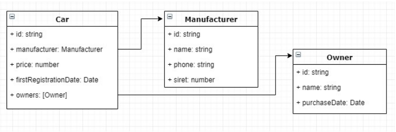

## Description

Coding test
NodeJs/Typescript
Exercice:
This coding exercise consists in implementing a little backend micro-service which aims to serve the cars
data.
This component will expose a REST api providing CRUD operations to fetch one or several cars, create,
update and delete a car. Though this api, it will also be possible:
- Fetch only the manufacturer data for a given car (without any manufacturers dedicated APIs – i.e.
only by using the car API)
- To trigger a process which will automatically remove the owners who bought their cars before the last
18 months and apply a discount of 20% to all cars having a date of first registration between 12 and
18 months.
The car data model will be kept relatively simple: 



The application has to be configured to run in a Docker container. Moreover, the expected (and
mandatory) programming paradigm to respect is the OOP (oriented-object programming).
The language to use will be Typescript and the framework Nestjs (https://nestjs.com/).
Code source will be delivered though a personal github account or sent by mail (by attaching the archive). 

## Installation

```bash
$ npm install
```
## API

You can use **Postman client** (https://www.postman.com/) to test and work with api. Import data from **postman_collection.json** file to your Postman client.
To access **Swagger docs** use 0.0.0.0:3000/api while server is running.

## Start with Docker
```bash
docker-compose up
```

## Run app

```bash
$ npm run start

# development
$ DOTENV=.env.development npm run start
```

## Test

```bash
# unit tests
$ npm run test

# e2e tests
$ npm run test:e2e
```
